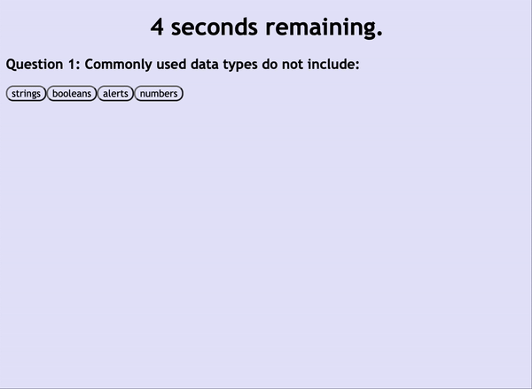

# JavaScript Quiz

## Description

The JavaScript Quiz is a simple way to test one's understanding of JavaScript with four questions. Once the player clicks the start button, a 75 second timer to play will begin. The player will be prompted with four multiple choice options per question with one correct answer. If you get a question correct, you will proceed to the next question or the game will end if you are on the last question. If you get a question incorrect, 15 seconds will be deducted from your timer. Your final score for the game will be the number of seconds remaining. If you run out of time, your score is automatically a 0 and the game ends. The lowest possible score you can get is 0. 

After playing, you will be prompted to type your name. Your name and score are then recorded onto a leaderboard sorted in order from highest to lowest scores. Your score and name will be highlighted in yellow. Even if you refresh the page, you will continue adding onto the same leaderboard. 

## Screenshot

Below is a GIF demonstrating the JavaScript Quiz functionality. 

Below is a GIF demonstrating what the JavaScript Quiz does when you run out of time. 

## Link to the JavaScript Quiz

The JavaScript Quiz can be found by clicking [here](https://mshaari.github.io/javascript-quiz/).